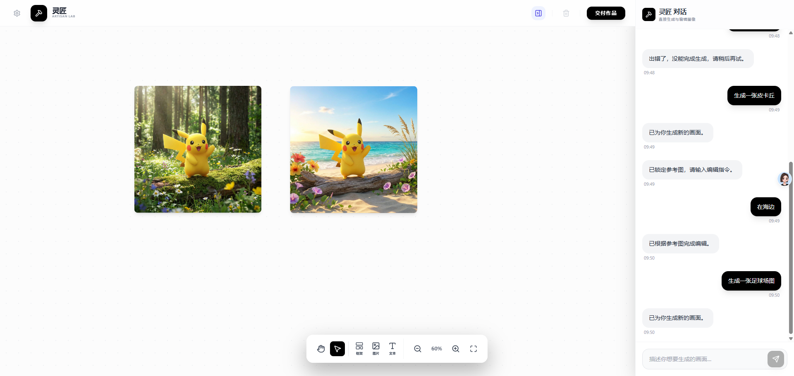
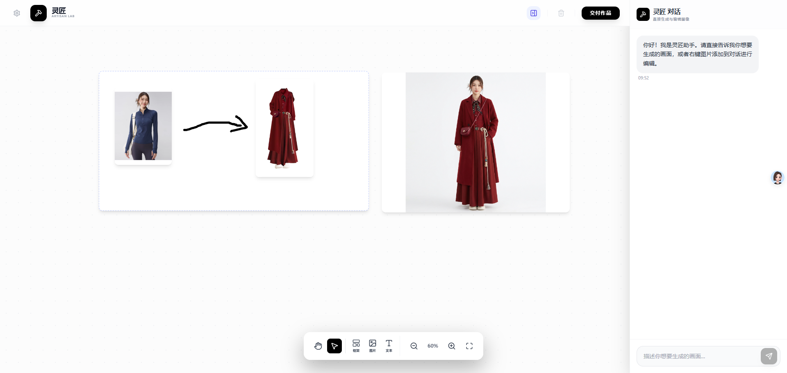
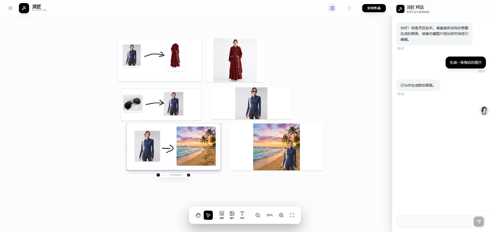

<div align="center">

# 灵匠 Artisan Lab

**All-in-One 无限画布 AI 图像创作工作台**



</div>

---

## 项目简介

灵匠是一款基于 **无限画布** 设计理念的 AI 图像创作工具。它将图像生成、编辑、换装、涂鸦等功能整合到一个自由的画布空间中，让创作者能够像在白板上构思一样，通过视觉布局来表达创作意图。

### 设计理念

**All-in-One 无限画布**

传统的 AI 图像工具往往是单一功能的线性流程——输入提示词，输出图片。灵匠打破了这种模式：

- **空间即逻辑**：在画布上摆放元素的位置关系本身就是一种"语言"。箭头代表转换方向，并列代表组合意图
- **所见即所得**：不再需要复杂的文字描述，直接在画布上拖拽、涂鸦、组合，AI 会理解你的视觉意图
- **一站式创作**：从灵感草图到成品输出，全部在同一个画布空间完成



---

## 核心功能

### 无限画布

- 自由缩放（10% - 500%）
- 无边界平移
- 多元素自由布局
- 框选批量操作
- 图层层级管理

### 视觉逻辑推理

灵匠的核心能力在于理解画布上的"视觉语义"：

| 视觉布局 | AI 理解 |
|---------|--------|
| A → B（箭头指向） | 将 A 的属性应用到 B |
| 人物 + 衣服（并列） | 执行换装操作 |
| 涂鸦线条 | 特效、路径或区域标记 |

### 灵感捕捉框架

创建一个"框架"区域，在其中自由组合图片、文字、涂鸦，然后一键生成。框架会自动捕捉区域内的所有元素，理解它们的空间关系，输出符合意图的结果。

### AI 对话编辑

右键任意图片可将其"锁定"为参考图，然后通过自然语言描述进行编辑。适合精细调整和迭代优化。



---

## 快速开始

### 环境要求

- Node.js 18+
- 支持 Gemini API 的网络环境

### 安装运行

```bash
# 安装依赖
npm install

# 配置 API（在界面左上角设置按钮中配置）
# 或编辑 .env.local 文件

# 启动开发服务器
npm run dev
```

### API 配置

点击界面左上角的设置图标，填入：
- API 地址（支持自定义代理）
- API 密钥
- 模型名称（默认 gemini-2.0-flash-exp-image-generation）

---

## 使用指南

### 基础操作

| 操作 | 方式 |
|-----|-----|
| 平移画布 | 按住空格键 + 拖拽 |
| 缩放画布 | Ctrl + 滚轮 |
| 选择元素 | 单击 |
| 多选元素 | 框选 或 Shift + 单击 |
| 删除元素 | Delete / Backspace |

### 创作流程

1. **添加素材**：通过工具栏上传图片或添加文本
2. **创建框架**：点击"框架"按钮创建灵感捕捉区域
3. **布局组合**：在框架内摆放元素，用位置关系表达意图
4. **涂鸦标注**：切换画笔工具进行涂鸦（可选）
5. **生成输出**：输入提示词（可留空让 AI 自动推理）并点击生成

---

## 技术栈

- React 19
- TypeScript
- Vite
- Tailwind CSS
- Lucide Icons
- Google Gemini API

---

## 开源协议

MIT License

