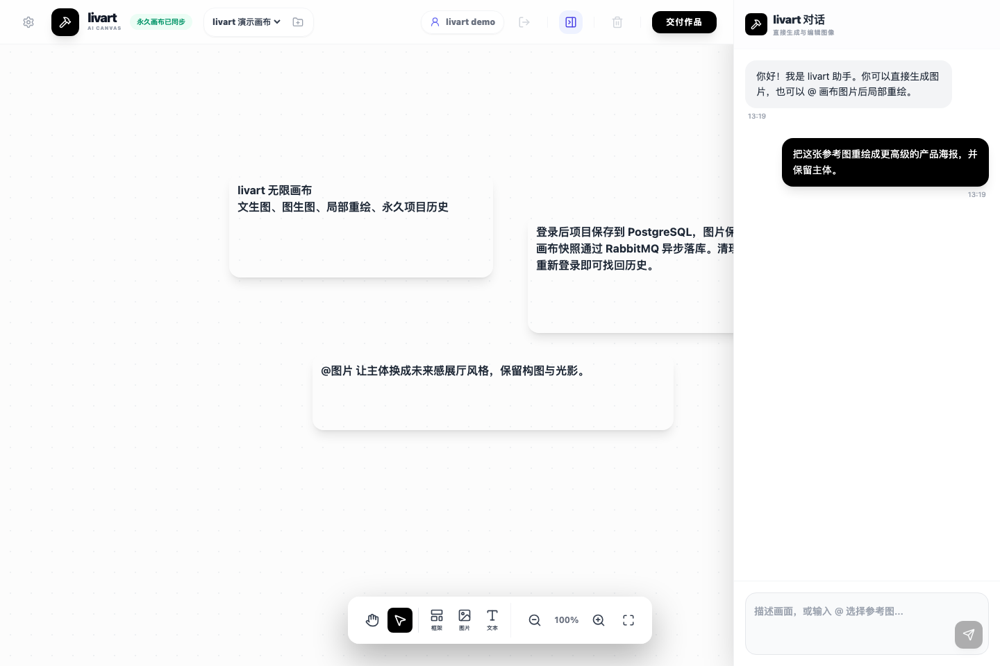

<div align="center">

# livart

**面向普通用户的一键部署 AI 图像创作工作台**

### 🚀 在线体验 / 生产环境

[https://livart.suntools.pro](https://livart.suntools.pro)

[Gitee](https://gitee.com/sunowen/livart) · [GitHub](https://github.com/yiersan-2026/livart)



</div>

---

## 项目简介

livart 是一款基于 **无限画布** 的 AI 图像创作工作台，目标是让没有编程经验的用户也能通过 Docker 一键部署并立即使用。它把文生图、图生图、局部重绘、删除物体、一键去背景、多角度改视角、前端裁剪、文字图层、画幅控制、图片引用、拖拽素材、多项目画布、历史记录、WebSocket 生图状态恢复、撤回重做和 ZIP 下载整合到一个自由画布中。

和普通聊天式生图工具不同，livart 更强调“在画布上表达意图”：用户可以拖入多张图片，用 `@` 引用图片，圈选局部区域，再用一句话描述“把这张图里的鞋子放到那张图的桌子上”“删除圈起来的文字”“把参考图放到圈选位置”等跨图编辑需求。系统会尽量保留原图，并把新图作为派生节点放在原图旁边，方便反复迭代和对比。

右侧对话框现在统一走 Agent 入口：用户可以直接问系统怎么用，也可以提出生成或编辑需求。Agent 会先把用户输入归类为固定的“问答”或“生图”，问答会检索 livart 系统知识库后回答，生图会继续规划并创建一个或多个图片任务；意图识别和提示词优化阶段不做内容审核、不提前拒绝，最终是否能生成由上游生图接口判断。所有普通回答都会自动排版成更易读的对话文本，长文本会拆成段落，编号和列表会转成结构化条目，错误和失败信息会以醒目的提醒样式显示，避免把大段原始文本直接堆给用户。

本项目基于上一个开源系统 [yiqi-software/ArtisanLab](https://gitee.com/yiqi-software/ArtisanLab) 二次开发而来。原项目提供了无限画布、基础 AI 图像生成、画布元素编辑和视觉逻辑工作流能力；livart 在此基础上补充了更完整的图生图、局部重绘、删除物体、永久画布、账号体系、后端持久化、图片资源压缩、Docker 部署和 Lovart 风格交互。

当前开源地址：[Gitee sunowen/livart](https://gitee.com/sunowen/livart.git) · [GitHub yiersan-2026/livart](https://github.com/yiersan-2026/livart.git)

## 本版本新增能力

- **Docker 一键部署**：提供多阶段 `Dockerfile`、默认 `docker-compose.yml` 和安装脚本，可同时启动 livart、PostgreSQL、RabbitMQ 和 MinIO。
- **Docker 复用模式**：如果用户已有 PostgreSQL、RabbitMQ、MinIO，可通过 `docker-compose.reuse.yml` 只启动 livart，避免重复下载和启动第三方服务。
- **站点统计展示**：顶部会显示当前注册用户数、成功生成图片数、当前正在进行的生图任务数，以及服务器内存、CPU、硬盘占用；前端每 3 秒刷新一次。Linux 内存占用优先读取 `/proc/meminfo` 的 `MemAvailable`，避免把系统缓存误算成真实占用。成功生成数只统计 AI 文生图、图生图、局部重绘、去背景、删除物体、多角度等生成/编辑结果，上传图片、社媒/自媒体导入图片和裁剪图不会计入，方便开源部署者观察真实 AI 使用情况和服务器压力。
- **Agent 对话入口**：右侧输入框统一提交到 `/api/agent/runs`，由 Agent 先返回固定意图分类“问答”或“生图”；问答走系统知识库回答，生图再规划文生图、图生图编辑、删除物体、去背景、图层拆分、局部重绘或多角度任务。
- **四行右侧输入框**：右下角创作输入框默认可显示四行内容，长提示词、`@` 图片引用、画幅选择和 Skill 选择可以在同一区域内完成，减少输入时频繁滚动。
- **格式化回答排版**：系统回答不再裸露展示长文本，会自动拆分段落、识别中文/数字编号和项目列表，并用简洁文本、列表和错误提醒样式呈现。
- **系统知识库 RAG**：关于 livart 功能、使用方法和限制的问题会先检索 PostgreSQL 系统知识库；安装 pgvector 后优先走向量检索，没有 pgvector 时仍保留关键词兜底。
- **独立生图接口配置**：文生图、图生图和提示词优化统一由后端代理，默认支持 OpenAI Images API 兼容格式，API Key 按用户隔离保存。
- **默认 2K 文生图**：后端会在 `gpt-image-2` 文生图请求前按画幅自动注入 `size`，默认长边 `2048`；实测单纯写“4K/超高清”只返回 1024，而 `4096x4096` 会被当前中转站返回 502。
- **图生图与局部重绘**：选中图片后会自动写入右侧输入框的 `@` 上下文，也可进入“编辑元素”模式涂抹区域并通过 `mask` 精确修改局部。
- **一键删除物体**：选中图片后点击 `橡皮工具`，涂抹或圈住要删除的内容即可调用局部重绘自动擦除并补全背景，输出仍保留原图画幅。
- **独立蒙版草稿**：`编辑元素` 和 `橡皮工具` 分别保存局部重绘蒙版与删除物体蒙版，两个工具的画笔和橡皮互不擦除，切换回来仍能继续编辑各自范围。
- **一键去背景**：选中图片后点击 `去背景`，后端会让 AI 先识别画面主要主体（人物、商品、动物、车辆或成组前景对象），只保留主体及其穿戴/手持/贴附部分，把主体以外的一切内容替换为纯白色背景。
- **多角度 / 改视角**：选中图片后点击 `多角度`，弹出 Lovart 风格 3D 球面观察面板；系统会把原图当作固定不动的完整三维场景，只移动相机/观察点。画面中所有可见元素（人物、动物、车辆、家具、道具、背景、地面/室内结构、建筑、光源、阴影和反射）都要按同一个新相机位姿产生一致透视变化；人物和物体保持原姿态、原头部朝向和原视线，不会要求主角追随新镜头。即使原图人物直视原始镜头，侧面或斜侧新视角也会明确要求看到侧脸/三分之四脸，并禁止人物继续直视当前观看者或新相机。
- **实验性图层拆分（默认隐藏）**：后端已保留 `主体层` 和 `背景层` 两类编辑模式；主体层尽量输出透明 alpha，背景层会移除主体并自然补全背景，原图不被覆盖。当前按钮默认隐藏，等模型稳定后再开放。
- **非破坏式图片重绘**：直接重绘或局部重绘会在原图右侧留出间距创建新图片节点，并在数据里保留 `parentId` 派生关系。
- **纯前端裁剪 Crop**：选中图片后可拖动裁剪框，保存为新的派生图片节点，不覆盖原图。
- **Lovart 风格选中态**：选中图片只显示细边线和图片上方紧凑工具条，不再在图片下方弹出输入框；单纯选中图片不会自动把图片 `@` 到右侧输入框，只有用户主动输入 `@`、使用快捷编辑或点击明确的图片操作入口时才会带入图片上下文。
- **快捷编辑工具条**：选中图片后按 `Tab` 或点击图片上方工具条左侧“快捷编辑”可在图片下方弹出输入框，并自动把图片缩放居中；工具条还提供裁剪、编辑元素、橡皮工具、去背景、多角度、改颜色、增强、放大和下载入口。
- **单图编辑聊天记录**：图片快捷编辑、局部重绘和删除物体也会同步写入右侧对话流，用户消息会带原图预览，生成完成后会显示新图预览，失败时直接显示错误原因。
- **结果持久化校验**：单图编辑、去背景和局部重绘必须先把返回图片成功上传到后端资源库后，才会在右侧对话显示“已完成”，避免上游成功但画布无图时误报成功。
- **Lovart 风格文字工具**：底部文字工具会先让鼠标进入十字放置模式，点击画布后输入文字；文字有内容后才显示外框，并支持字体搜索、字号、字重、颜色、描边和对齐调整。
- **大图预览**：右侧对话和画布图片可打开沉浸式大图，使用最大 WebP 预览展示，支持 100% 步进放大、旋转、点击空白关闭，并在右下角直接下载原图。
- **撤回与重做**：图片移动、画布视图和背景色等操作进入历史栈，可用底部工具栏或快捷键撤回/重做。
- **左下角画布工具坞**：提供画布颜色、已生成文件列表和小地图三个入口；文件列表支持搜索并定位到画布图片。
- **导出增强**：下载菜单支持按选中图、最终图、全部派生图或项目交付包打包导出。
- **画幅比例选择**：文生图、图生图和局部重绘支持 `自动`、`1:1`、`4:3`、`3:4`、`16:9`、`9:16`。
- **自适应图片框**：生成或重绘完成后会读取真实图片尺寸，画布图片框自动匹配图片比例，不再强制正方形。
- **原图/WebP 预览分层**：上传和生成图片保留原始格式，页面展示全部走 WebP 预览，后端会生成 `512 / 1024 / 2048` 宽度档位并按画布缩放自动取图，下载时仍下载原图。
- **WebSocket 生图状态推送**：生图任务统一由 `/api/agent/runs` 提交，运行、排队、完成和失败状态通过 `/ws/image-jobs` 实时推送；失败会同步显示在右侧对话和画布占位图上，不再用轮询兜底；正常连接不会再显示“已重新连接，正在同步图片结果”，只有真实断线时才显示等待重连，重连后继续展示原执行流程；完成结果会按图片 ID 幂等追加，避免重连后同一张图在右侧对话里重复提示；右侧输入框会显示正在执行的任务耗时，默认 `16` 个图片 worker 并发处理多用户、多图片任务，超过并发上限的任务会进入队列并在对话框显示排队位置。
- **内联提示词自动优化**：前端不再单独调用优化接口；后端会在真正请求上游文生图/图生图接口前，结合图片角色分析自动优化提示词。优化阶段只负责润色和补齐视觉描述，不做生图审核；如果优化模型超时、失败或返回拒绝话术，会直接使用用户原始提示词继续提交给生图接口，由最终生图接口判断是否可生成。
- **提示词记录留档**：每次文生图、图生图、局部重绘、删除物体和裁剪都会在图片节点保存原始提示词与优化后提示词，便于后续追溯、导出和排查。
- **Lovart 风格图片引用**：右侧输入框支持输入 `@` 选择画布图片，并以可删除的内联标签参与提示词上下文。
- **图片拖入画布**：支持直接把本机图片拖进画布，自动创建图片节点。
- **社交媒体图片导入**：底部工具栏新增“社媒图片”入口，支持抖音、小红书、微博、哔哩哔哩、知乎链接，后端代理解析图片列表，用户选择后导入画布并保存为本站图片资源；导入后的社媒图片会进入右侧输入框 `@` 选择器，可按图片标题、文件名或“社媒/社交媒体/外部导入”搜索引用；解析接口 Key 可通过 GoGoTool 的开放接口自行生成，不需要把共享密钥写进前端或仓库。
- **开源与商城入口**：顶部左侧提供 Gitee、GitHub 和“热门AI产品贴纸”外链入口，图标统一使用单色风格，方便开源用户快速跳转项目主页或周边商品页。
- **并行图片处理**：多个图片的重绘状态互不阻塞，切换图片不会清空各自输入内容。
- **永久画布后端**：新增 Spring Boot + MyBatis Plus 后端，用 PostgreSQL 保存画布项目，用 MinIO 保存图片资源。
- **站点概览统计**：后端提供站点级用户数、AI 成功生成图片数、当前排队/运行中的生图任务数、服务器内存占用、CPU 占用和根分区硬盘占用统计，前端每 3 秒自动拉取并展示在顶部操作区；上传素材、社媒/自媒体导入素材和裁剪派生图会被排除。
- **Spring Security JWT 登录**：支持账号注册、登录和 30 天 JWT，会话清理后重新登录即可找回账号下的项目画布。
- **异步保存队列**：画布保存请求进入 RabbitMQ，后端单消费者按顺序落库，并通过 revision 避免旧数据覆盖新数据。
- **多项目画布**：支持创建多个项目，一个项目对应一张独立画布，并记住最近打开的项目。
- **开发环境一键重启**：新增 `scripts/restart-dev.sh`，可一次性重启本地前端 `3000` 和后端 `8080`，自动读取 `.env`、`backend/.env`、`frontend/.env.local`，并把日志写入 `.codex-run/dev`。
- **画布体验优化**：缩放逻辑改为以鼠标位置为锚点，输入框滚动、键盘快捷键冲突、重连提示误报和重启后临时加载状态残留已修复。

## 核心功能

### 无限画布

- 自由缩放（10% - 500%）
- 无边界平移
- 多元素自由布局
- 框选批量操作
- 图层层级管理
- 以鼠标位置为中心的缩放体验
- 本机图片拖拽导入

### 视觉逻辑推理

livart 会尝试理解画布上的视觉语义：

| 视觉布局 | AI 理解 |
|---------|--------|
| A → B（箭头指向） | 将 A 的属性应用到 B |
| 人物 + 衣服（并列） | 执行换装操作 |
| 涂鸦线条 | 特效、路径或区域标记 |

### 局部重绘

选中图片后点击图片上方工具条里的“编辑元素”按钮，即可使用画笔涂抹需要修改的区域。右侧输入框会自动引用当前图片，提交后系统会把涂抹区域转换为 Images API 的 `mask` 参数，只重绘被涂抹的区域，未涂抹区域尽量保持原图不变。局部重绘蒙版会和删除物体蒙版分开保存，擦除局部重绘范围时不会误擦掉删除物体的红色范围。

重绘不会覆盖原图，而是在原图右侧生成一个新的图片节点。新图会记录父级图片和提示词，但画布默认不显示派生箭头，避免干扰创作空间。

### 删除物体

选中图片后点击 `橡皮工具`，画笔会切换为红色蒙版。像 Lovart 一样，直接圈住要删除的物体即可，松开鼠标后系统会自动填充圈内区域并适度扩边；也可以直接涂抹。右侧输入框可保持默认“把圈起来的地方删除掉”，也可以补充“保持桌面纹理”“不要影响人物手部”等要求。删除物体会复用图生图局部重绘接口，只把蒙版区域作为可编辑区域，提示模型删除物体并用周围背景自然补全，生成结果会作为原图的派生图片放在右侧，不会覆盖原图。删除物体蒙版独立于 `编辑元素` 蒙版，红色删除范围和蓝色重绘范围可以在同一张图片上分别维护。

### 去背景

选中图片后点击图片上方工具条里的 `去背景`。系统会先让 AI 判断画面主要主体：人物、商品、动物、车辆或多个共同构成前景的对象都可以作为主体；主体的穿戴物、手持物、贴附物和直接组成整体的部分会一起保留。主体以外的一切背景和无关物体会被替换为纯白色背景（#FFFFFF），不会输出透明背景，也不会生成新场景。

为了减少“去背景后主体变了”的问题，提示词会明确约束只改变非主体区域为纯白底，尽量保持主体 RGB 像素、裁切范围、构图、表情、姿态、服装、材质、颜色、纹理、发丝和边缘细节不变，也禁止补全原图画面外被裁切掉的内容。

### 裁剪、快捷编辑与画布工具

选中图片后，图片上方会出现一行紧凑工具条，提供 `裁剪`、`编辑元素`、`橡皮工具`、`去背景`、`多角度`、`改颜色`、`增强`、`放大` 和下载入口。拖动图片时工具条会暂时隐藏，拖拽结束后再显示，缩放画布时工具条保持屏幕尺寸不变。

裁剪是纯前端能力：拖动裁剪框后点击“保存为新图”，系统会从原图裁出新图片节点，并把新节点挂到原图的 `parentId` 派生关系上。AI 重绘、删除物体和裁剪结果都会保留原始提示词、优化后提示词和父级图片 ID，方便后续导出、追溯和排查。

多角度改视角参考 Lovart 的球面观察交互方式：点击 `多角度` 后会打开参数面板，中间是包围画面内容的 3D 圆球。中心预览图用于表达当前原图内容，外层经纬线球体使用 3D 透视旋转并套在图片中心，球面上的黑色点阵眼睛表示当前观察点。眼睛和连接线共用同一套 3D 球面坐标，观察点沿球体半径贴合在球面表面，连线始终指向眼睛中心。用户可以拖动球面让观察点在受限范围内移动：左右各 `90°`，上方最高 `60°`，下方最低 `-30°`；也可以精确调整 `方位角 / 俯仰角 / 缩放`，点击重置会回到 `0° / 0°`。点击 `应用` 后会走同一套 Agent 图片编辑链路，提示词会明确告诉模型：这是“相机位置变化”，不是旋转某个主角或单个物体；画面中人物、动物、车辆、家具、道具、背景、地面、墙面、建筑、光源、阴影和反射都需要按同一个新相机位姿产生一致透视变化。人物/动物角色会被要求保持原身体姿态、头部朝向、表情、动作和眼神方向；如果原图角色看向原始镜头，新视角也只是从侧面观察这个固定姿态，不要求角色重新看向新镜头。后端会在提示词优化完成后再次追加视线锁定约束，避免优化器把“不看新镜头 / not looking at viewer / no direct eye contact with the new camera”这类关键要求丢掉。当前它是基于图生图模型的参数化整图视角编辑，不是严格 3D 重建。

图层拆分参考 Lovart 的语义拆层思路：先让 AI 识别主图中的主要前景主体，再分别创建主体层和背景层。主体层会要求保留原图主体的位置、比例、边缘、材质和裁切，并把主体外区域输出为透明 alpha；背景层会要求移除主体、阴影和残影，并按周围背景自然补全。当前实现是 AI 编辑接口 MVP，不是传统 Photoshop 级像素级分割；如果上游模型不支持透明 alpha，主体层可能退化为带背景的主体图。该入口目前默认隐藏，后续会在模型稳定后重新开放。

左下角三个画布工具分别用于：设置纯色画布背景、打开已生成文件列表、打开小地图。文件列表可以按名称、提示词或 ID 搜索图片并点击定位；小地图可快速查看画布分布并跳转到远处内容。

### 画幅与图片框

生图和重绘入口都支持选择画幅：

| 选项 | 说明 |
|------|------|
| 自动 | 文生图默认使用 1:1 的 2K 方图；图生图和局部重绘沿用参考图比例 |
| 1:1 | 方图 |
| 4:3 / 3:4 | 横向或竖向标准画幅 |
| 16:9 / 9:16 | 横向宽屏或竖向手机画幅 |

使用 `gpt-image-2` 文生图时，后端默认会把这些画幅映射成真实 2K 请求尺寸：`1:1=2048x2048`、`16:9=2048x1152`、`9:16=1152x2048`、`4:3=2048x1536`、`3:4=1536x2048`。如果你的中转站不支持 2K `size` 参数，可在环境变量里设置 `LIVART_DEFAULT_IMAGE_SIZE_ENABLED=false` 关闭，或用 `LIVART_DEFAULT_IMAGE_LONG_SIDE` 调整默认长边。

生成完成后，livart 会按返回图片的真实宽高调整画布图片框；如果上游模型实际返回的比例和请求比例不同，画布仍以真实图片形状为准。

为了让无限画布在多张大图时保持流畅，后端会在图片上传到 MinIO 时保留原始格式文件，并额外生成 `512 / 1024 / 2048` 三个宽度档位的 WebP 预览图。画布渲染、右侧聊天预览和 `@` 图片选择器会根据当前缩放优先加载合适宽度的 WebP；原始图片 URL 会继续保存在画布状态里，用于高清下载、AI 图生图、局部重绘和后续高清处理。

### 永久画布项目

livart 支持创建多个项目画布。前端会把画布元素、消息、缩放位置和图片资源保存到后端：

- PostgreSQL：保存项目、画布状态和快照记录
- PostgreSQL + pgvector：保存 livart 系统知识库向量，用于回答系统功能、使用方法和限制类问题
- MinIO：保存画布中的图片资源
- RabbitMQ：串行化保存请求，减少并发保存冲突
- 用户系统：项目和上传资源按登录账号隔离，清理浏览器缓存后可通过账号重新加载历史记录

## 项目结构

```text
frontend/  React + Vite 前端
backend/   Spring Boot + MyBatis Plus 后端
docs/      项目说明和真实截图
```

## 快速开始

### 环境要求

- 普通使用者：只需要安装 Docker Desktop
- 开发者本地调试：Node.js 18+、Java 17+、PostgreSQL（建议安装 pgvector 扩展）、MinIO、RabbitMQ
- 生图能力：支持 OpenAI Images API 兼容接口或 Gemini 图像接口的网络环境

### Docker 一键部署

项目根目录提供了多阶段 `Dockerfile` 和自包含的 `docker-compose.yml`：Compose 会同时启动 livart、带 pgvector 的 PostgreSQL、RabbitMQ 和 MinIO。浏览器访问同一个 Spring Boot 服务即可，前端统一提交到 `/api/agent/runs`，由后端 Agent 判断是系统问答还是图片任务；系统功能问答会先检索 PostgreSQL 向量知识库，图片任务会进入统一规划和异步生图链路，提示词优化已经内置在后端生图链路中，生图任务状态通过同域 `/ws/image-jobs` 推送。

先打开 Docker Desktop，等它显示 Docker 正在运行。macOS / Linux / WSL 用户推荐执行安装脚本：

```bash
./docker/install.sh
```

脚本会先检查当前 Docker 里是否已经有正在运行的 PostgreSQL、RabbitMQ、MinIO：如果 `.env` 里已经填好了这些服务的连接信息，就只启动 livart 并复用现有服务；如果没有检测到完整的第三方服务，就使用完整模式自动启动 livart、PostgreSQL、RabbitMQ 和 MinIO。完整模式也会优先复用本地已有镜像，缺少时才下载。也可以直接执行这一条标准 Compose 命令：

```bash
docker compose up -d --build
```

启动后访问：

- livart：`http://localhost:8080`
- MinIO 控制台：`http://localhost:9001`，默认只绑定本机 `127.0.0.1`

进入 livart 后先注册一个账号；第一次生图时，在页面配置 AI 中转站 Base URL、API Key、生图模型和对话模型即可。后续项目、图片和配置都会自动保存。如果你在 `.env` 中预先填写了 `LIVART_DEFAULT_API_BASE_URL` 和 `LIVART_DEFAULT_API_KEY`，新用户会直接使用服务器默认 AI 配置，不会强制弹出初始配置框；真实 Key 只保存在服务端，不会下发到浏览器。

如果 Docker 里已经有可用的 PostgreSQL、RabbitMQ、MinIO，不想再下载/启动一套新的第三方服务，可以用复用模式：

```bash
cp .env.reuse.example .env
# 把 .env 里的 DB、RabbitMQ、MinIO 地址和口令改成你现有服务的信息
./docker/install.sh reuse
# 或者直接使用 Compose
docker compose -f docker-compose.reuse.yml --env-file .env up -d --build
```

复用模式只构建并启动 livart，不会启动 `postgres`、`rabbitmq`、`minio` 服务。默认会通过 `host.docker.internal` 访问宿主机上已经暴露端口的第三方容器；如果你的第三方容器使用其他地址，请直接修改 `.env` 里的 `DB_HOST`、`RABBITMQ_HOST`、`MINIO_ENDPOINT`。已有 PostgreSQL 需要提前创建好数据库，建议安装 pgvector 扩展以启用系统知识库向量检索；没有 pgvector 时会退回关键词检索。已有 RabbitMQ/MinIO 账号需要有创建队列和 bucket 的权限。

如果要改端口或用于公网部署，建议先创建 `.env` 覆盖默认口令：

```bash
cp .env.example .env
# 按需修改 .env 后启动
docker compose up -d --build
```

不要把包含数据库密码、MinIO 密钥、RabbitMQ 密码或 AI API Key 的 `.env` 文件提交到仓库。Docker 默认启用 `SPRING_PROFILES_ACTIVE=prod`，生产配置会从环境变量读取数据库、RabbitMQ、MinIO 和 JWT 等参数；如果没有设置服务器默认 AI 配置，用户仍然可以登录后在页面里填写自己的中转站配置，并按用户保存到数据库。

Docker 部署时，应用日志默认写入容器内 `/tmp/livart-logs/livart-backend.log`，按天滚动并默认只保留最近 1 天；Docker stdout 日志也限制为单个 10MB 文件，避免长期运行撑满磁盘。如需调整，可在 `.env` 中设置 `LOG_PATH`、`LOG_MAX_HISTORY`、`LOG_TOTAL_SIZE_CAP`。如果像官方生产环境一样用 systemd 直接运行 Jar，也可以在 systemd 里把标准输出写到 `/var/log/livart/app.log`、错误输出写到 `/var/log/livart/error.log`。

图片生成任务默认使用 `LIVART_IMAGE_JOB_WORKER_COUNT=16`，适合 16 核服务器并行处理多用户任务；超过并发上限的图片任务会自动排队，前端会通过 WebSocket 在右侧对话框提示“排队中”和当前位置。如果上游接口限流或 502/504 增多，可以在 `.env` 中把它降到 `8` 或 `12` 后重启服务。

### 启动后端

```bash
cd backend
cp .env.example .env
# 填入 PostgreSQL、MinIO、RabbitMQ、JWT_SECRET 等配置
set -a
source .env
set +a
mvn spring-boot:run
```

后端配置分为三层：

- `backend/src/main/resources/application.yml`：公共配置，默认启用 `dev` profile。
- `backend/src/main/resources/application-dev.yml`：开发环境默认值，适合本地调试，可通过环境变量覆盖。
- `backend/src/main/resources/application-prod.yml`：生产环境配置，数据库、RabbitMQ、MinIO、JWT 等敏感项必须来自环境变量。

本地调试默认就是 `dev`；如果要模拟生产配置，可执行：

```bash
SPRING_PROFILES_ACTIVE=prod mvn spring-boot:run
```

### 启动前端

```bash
cd frontend
npm install
npm run dev
```

前端开发服务器会把 `/api/auth`、`/api/user`、`/api/canvases`、`/api/canvas`、`/api/assets`、`/api/agent`、`/api/image-jobs`、`/api/health` 和 `/ws/image-jobs` 代理到 `http://localhost:8080`。

首次进入页面需要注册或登录账号。登录成功后，前端会把 JWT 保存在浏览器本地；如果浏览器缓存被清理，只要重新登录同一个账号，就会从后端加载该账号下的项目画布历史。

### 一键重启开发环境

本地开发时可以直接使用项目脚本同时重启前后端：

```bash
./scripts/restart-dev.sh
```

脚本会停止当前监听 `3000` 和 `8080` 的 livart 开发进程，然后启动后端 `mvn spring-boot:run -Dspring-boot.run.profiles=dev` 与前端 Vite dev server。配置读取顺序为 `.env`、`backend/.env`、`frontend/.env.local`，如果本机有 Codex 本地记忆文件，也会作为开发环境兜底；日志写入 `.codex-run/dev/backend.log` 和 `.codex-run/dev/frontend.log`。该脚本只处理前端 `3000` 与后端 `8080`，不会触碰其他项目端口。

### Jenkins 生产部署

官方生产环境通过 Jenkins 从 Gitee `main` 分支拉取代码、构建前后端并重启服务。仓库提供了复用脚本：

```bash
./scripts/deploy-jenkins.sh
```

脚本会触发 Jenkins job、等待构建结果，并在成功后访问生产健康检查地址。默认值适配官方生产环境：

- `JENKINS_URL=https://jenkins.ai987654321.com`
- `JENKINS_JOB=livart-deploy`
- `JENKINS_USER=admin`
- `LIVART_HEALTH_URL=https://livart.suntools.pro/api/health`

开源用户可以把自己的 Jenkins 配置写入不提交仓库的 `.env.deploy`：

```bash
JENKINS_URL=https://jenkins.example.com
JENKINS_JOB=livart-deploy
JENKINS_USER=admin
JENKINS_TOKEN=your-jenkins-api-token
LIVART_HEALTH_URL=https://your-domain.example/api/health
```

也可以通过 `JENKINS_TOKEN_FILE` 或 `JENKINS_TOKEN_REMOTE_HOST` 让脚本从本机/远端文件读取 token。不要把真实 Jenkins token、SSH 密码或 `.env.deploy` 提交到 Git 仓库。

### API 配置

如果服务端没有配置默认 AI 网关，首次登录后会自动弹出中转站配置；如果服务端已经配置 `LIVART_DEFAULT_API_BASE_URL` 和 `LIVART_DEFAULT_API_KEY`，新用户会直接使用服务器默认配置。之后也可以点击界面左上角的设置图标修改。个人配置会保存到后端数据库，并按登录用户隔离，不同用户可以使用不同的中转站和模型。只需要填入：

- 中转站 Base URL，例如 `https://example.com/v1/`
- API Key
- 生图模型，下拉框目前固定为 `gpt-image-2`
- 对话模型，下拉框支持 `gpt-5.5`、`gpt-5.4`、`gpt-5.4-mini`、`gpt-5.3-codex` 和 `gpt-5.2`

默认文生图会对 `gpt-image-2` 加 `size` 生成真实 2K 原图；可通过 `LIVART_DEFAULT_IMAGE_SIZE_ENABLED=false` 关闭，或通过 `LIVART_DEFAULT_IMAGE_LONG_SIDE=1024/2048` 调整默认长边。

### 社交媒体图片导入

底部工具栏的“社媒图片”按钮会打开导入弹窗。当前支持抖音、小红书、微博、哔哩哔哩和知乎链接。用户粘贴帖子链接后，前端只请求本站 `/api/external/images`，由后端携带第三方接口 Key 调用外部解析服务，避免 Key 暴露到浏览器。解析返回的图片会在弹窗内按原始比例预览，用户可多选并导入到当前画布；导入后图片会保存进 MinIO，同时生成 WebP 预览档位，并作为普通画布图片进入右侧输入框的 `@` 选择器。

为了避免“社媒图导入了但 `@` 找不到”的体验问题，`@` 选择器会显示最近最多 80 张可用画布图片，导入图片会优先使用帖子标题或文件名作为可读名称；如果外部平台只返回“图片 1”这类泛化标题，livart 会自动改成“社媒图片 1”这类更容易搜索的名字。搜索框支持按标题、稳定 ID、`社媒`、`社交媒体`、`外部导入` 等关键词过滤。

如果你没有社交媒体图片解析 Key，可以用 GoGoTool 的开放接口生成一个：

```bash
curl -X POST https://gogotool.top/api/v1/external/api-keys
```

返回结构：

```json
{
  "data": {
    "apiKey": "gogo_xxx"
  }
}
```

把返回的 `apiKey` 填入服务端环境变量 `LIVART_EXTERNAL_IMAGES_API_KEY` 后重启 livart 即可。这个 Key 只应该保存在服务端 `.env`、Docker 环境变量或部署平台 Secret 中，不要写进前端代码，也不要提交到 Git 仓库。

相关环境变量：

- `LIVART_EXTERNAL_IMAGES_ENDPOINT`：社交媒体图片解析接口地址，默认 `https://gogotool.top/api/v1/external/images`
- `LIVART_EXTERNAL_IMAGES_API_KEY`：第三方解析接口 Key，必须在服务端 `.env` 或部署平台配置
- `LIVART_EXTERNAL_IMAGES_TIMEOUT_SECONDS`：解析和导入下载超时时间，默认 `45`

系统会自动拼接：

- 文生图：`{Base URL}/images/generations`
- 图生图：`{Base URL}/images/edits`
- 对话：`{Base URL}/responses`，如果接口不可用会直接报错

也可以在 `frontend/.env.local` 中预填默认值，用户保存后仍以数据库中的个人配置为准：

```bash
IMAGE_API_BASE_URL=https://example.com/v1/
IMAGE_API_MODEL=gpt-image-2
IMAGE_API_KEY=your-api-key
PROMPT_OPTIMIZER_MODEL=gpt-5.5
```

不要把真实 `frontend/.env.local`、`backend/.env` 或任何 API Key 提交到仓库。用户在界面里保存的 API Key 会写入后端数据库的个人配置表。

## 使用指南

| 操作 | 方式 |
|-----|-----|
| 平移画布 | 按 H 切换平移工具，或按住空格键 + 拖拽 |
| 缩放画布 | Ctrl + 滚轮 |
| 选择元素 | 按 V 切换选择工具，或直接单击元素 |
| 多选元素 | 框选 或 Shift + 单击 |
| 删除元素 | Delete / Backspace |
| 提交输入框 | Ctrl / ⌘ + Enter |
| 引用图片 | 在右侧输入框输入 @，再从弹出的图片选择器里选择画布图片 |
| 输入文字 | 点击底部文字工具 → 鼠标变十字 → 在画布位置点击后输入文字 |
| 选择画幅 | 在右侧输入框选择自动 / 1:1 / 4:3 / 3:4 / 16:9 / 9:16 |
| 快捷编辑 | 选中图片 → 按 Tab 或点击图片上方 `快捷编辑` → 输入修改要求并提交 |
| 删除物体 | 选中图片 → `橡皮工具` → 圈住或涂抹物体 → 右侧输入框提交 |
| 去背景 | 选中图片 → 图片上方工具条 `去背景` → 自动识别主体并把非主体区域改成纯白色 |
| 图层拆分 | 选中图片 → 图片上方工具条 `分层` → 生成主体层和背景层两个新节点 |
| 裁剪图片 | 选中图片 → `裁剪` → 调整裁剪框 → 保存为新图 |
| 撤回 / 重做 | 底部工具栏按钮，或 Ctrl / ⌘ + Z、Ctrl / ⌘ + Shift + Z |
| 下载图片 | 顶部 `下载` 默认下载选中图；没有选中图时下载全部；下拉菜单可选最终图、全部派生图或项目交付包 |
| 画布工具 | 左下角按钮可设置画布颜色、查看已生成文件列表、打开小地图 |

生成或重绘过程中可以直接刷新页面。后端图片任务会继续执行；页面重新加载后会根据画布中的 `jobId` 通过 WebSocket 重新订阅任务状态，任务完成后回填到原来的占位图片节点。失败时会在右侧对话和画布占位图上显示具体错误；只有任务已过期或后端重启导致任务丢失时，节点才会标记为失败。

### 创作流程

1. **添加素材**：通过工具栏上传图片或添加文本
2. **布局组合**：在无限画布上摆放素材，用位置关系表达意图
3. **引用图片**：在右侧输入框输入 `@` 选择图片；如果是快捷编辑、去背景、局部重绘等明确图片操作，系统会自动带入对应图片上下文
4. **圈选局部**：需要局部修改时，使用图片上方工具条进入编辑元素或橡皮工具
5. **生成输出**：输入提示词并点击生成，后端会在请求上游生图接口前自动优化提示词

### 局部重绘流程

1. 选中画布上的一张图片
2. 点击图片上方工具条里的“编辑元素”
3. 用画笔涂抹需要修改的区域，可用橡皮擦修正
4. 在右侧输入修改指令，例如“把涂抹区域改成蓝色花朵”
5. 选择需要的画幅比例，或保持“自动”沿用原图比例
6. 点击提交，后端会先结合图片引用和局部蒙版语义优化提示词，再调用图生图 `mask` 接口

## 技术栈

- React 19
- TypeScript
- Vite
- Tailwind CSS
- Spring Boot
- Spring Security JWT
- MyBatis Plus
- PostgreSQL
- MinIO
- RabbitMQ
- OpenAI Images API 兼容接口
- 社交媒体图片解析接口（后端代理）
- Google Gemini API（可选兼容）

## 开源来源与致谢

本项目基于 [yiqi-software/ArtisanLab](https://gitee.com/yiqi-software/ArtisanLab) 继续开发。感谢原项目提供的无限画布和 AI 图像创作基础能力。

livart 当前改动重点是把原有单机画布体验扩展为可长期使用的 AI 创作工作台：增加永久画布后端、项目管理、账号登录、JWT 鉴权、异步保存队列、图片资源存储、WebP 多档预览、后端内联提示词优化、Lovart 风格图片引用、社媒图片导入与引用、右侧聊天式编辑记录、非破坏式派生重绘、画幅比例选择、局部 mask 重绘、自适应图片框、Docker 一键部署和更稳定的图像接口代理。

## 开源协议

Apache License 2.0
